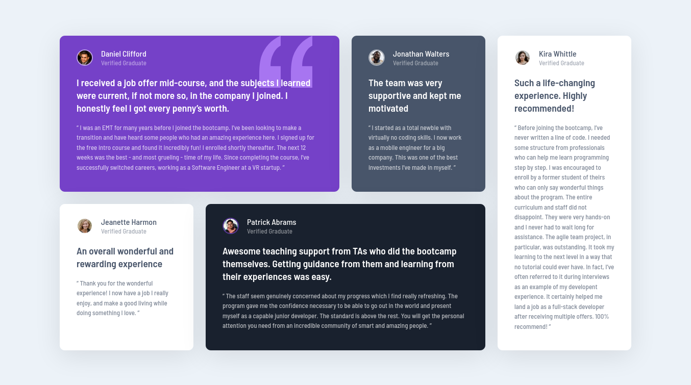

# Frontend Mentor - Testimonials grid section solution

This is a solution to the [Testimonials grid section challenge on Frontend Mentor](https://www.frontendmentor.io/challenges/testimonials-grid-section-Nnw6J7Un7). Frontend Mentor challenges help you improve your coding skills by building realistic projects. 

## Table of contents

- [Overview](#overview)
  - [The challenge](#the-challenge)
  - [Screenshot](#screenshot)
  - [Links](#links)
- [My process](#my-process)
  - [Built with](#built-with)
  - [What I learned](#what-i-learned)
  - [Continued development](#continued-development)
  - [Useful resources](#useful-resources)
- [Author](#author)
- [Acknowledgments](#acknowledgments)

## Overview

### The challenge

Users should be able to:

- View the optimal layout for the site depending on their device's screen size

### Screenshot

### Links

- [Solution URL](https://github.com/SArkar-Htet/testimonials-grid-section)
- [Live Site URL](https://sarkar-htet.github.io/testimonials-grid-section/)

## My process

### Built with

- Semantic HTML5 markup
- CSS custom properties
- Flexbox
- CSS Grid
- Mobile-first workflow
- SCSS

### Useful resources

- [CSS Grid Layout Module](https://www.w3schools.com/css/css_grid.asp) - This helped me to understand CSS Grid, its properties and how to use it.

## Author

- Frontend Mentor - [@SArkar-Htet](https://www.frontendmentor.io/profile/SArkar-Htet)
- Facebook - [Soe Arkar Htet](https://www.facebook.com/soearkar.htet.526)